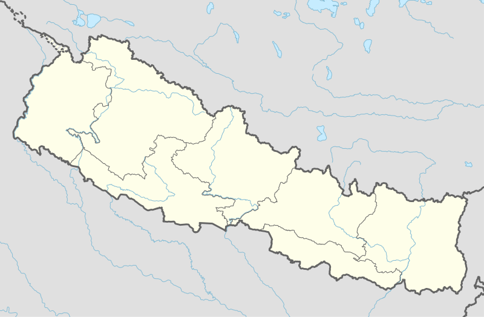

# Local States Nepal

##### This will help to get data about local states in nepal based on recent administrative division



Image Source: [Wikipedia(Provinces of Nepal)](https://en.wikipedia.org/wiki/Provinces_of_Nepal)

 [](//packagist.org/packages/sagautam5/local-states-nepal)
[](//packagist.org/packages/sagautam5/local-states-nepal)
[](https://github.com/sagautam5/local-states-nepal/issues) [](https://github.com/sagautam5/local-states-nepal/stargazers) 
[](https://github.com/sagautam5/local-states-nepal/blob/master/LICENSE) 
[](https://github.com/sagautam5/local-states-nepal/network/members) 
[](https://twitter.com/intent/tweet?text=Wow:&url=https%3A%2F%2Fgithub.com%2Fsagautam5%2Flocal-states-nepal)

## Description

  Local States Nepal is the php composer package to get structured dataset about local states in Nepal.  
  
  Local States Nepal Requires 
  
  PHP >= 5.5
  
## Demo

You can view Province -> District -> Municipality -> Wards in following demo.

Demo URL(English): https://stacklearning.com/local-state-demo  
Demo URL(नेपाली): https://stacklearning.com/local-state-demo-np

Demo Video:

https://www.loom.com/share/a8c3d825a9ee41a9817b24645453e979
    
## Support

Currently, This library supports following two languages.

- English 
- नेपाली
   
## Installation

```sh
composer require sagautam5/local-states-nepal
```

## Configuration

Currently, No mandatory configuration is required for using this package. We have used english as the default language and if you want nepali you have to specify the language while using this package.

## About Dataset
All data are collected from wikipedia and various Nepal government sites. We have data set in Nepali and English format for following four entities.

1. [Province](./docs/dataset/Province.md)
2. [District](./docs/dataset/District.md)
3. [Municipality](./docs/dataset/Municipality.md)
4. [Category](./docs/dataset/Category.md)
5. [Nested Data Set](./docs/dataset/NestedData.md)

You can see more details about data in the link provided in above list.

## Basic Usage

After installation, you can use features like this:

```php
use Sagautam5\LocalStateNepal\Entities\Province;

$province = new Province('np');

// Get List of all Provinces
$provincesData = $province->allProvinces();

// Get List of All Provinces with District
$provincesData = $province->getProvincesWithDistricts();

// Get List of All Provinces with District and Districts with Municipalities
$provincesData = $province->getProvincesWithDistrictsWithMunicipalities();
``` 

NOTE: Default language is 'en' and if you want 'np' then you have to specify language while creating class object.

You can see more detail documentation of each entity in the links provided in following list.

1. [Provinces](./docs/usage/Province.md)
2. [Districts](./docs/usage/District.md)
3. [Municipality](./docs/usage/Municipality.md)
4. [Category](./docs/usage/Category.md)

## Security

If you discover a security vulnerability within this package, please send an e-mail to sagautam5@gmail.com, All security vulnerabilities will be promptly addressed.

## 🤝 Contributing

Please see [CONTRIBUTING](CONTRIBUTING.md) for details.

## 📄 License

The MIT License (MIT). Please see [License File](LICENSE) for more information.
